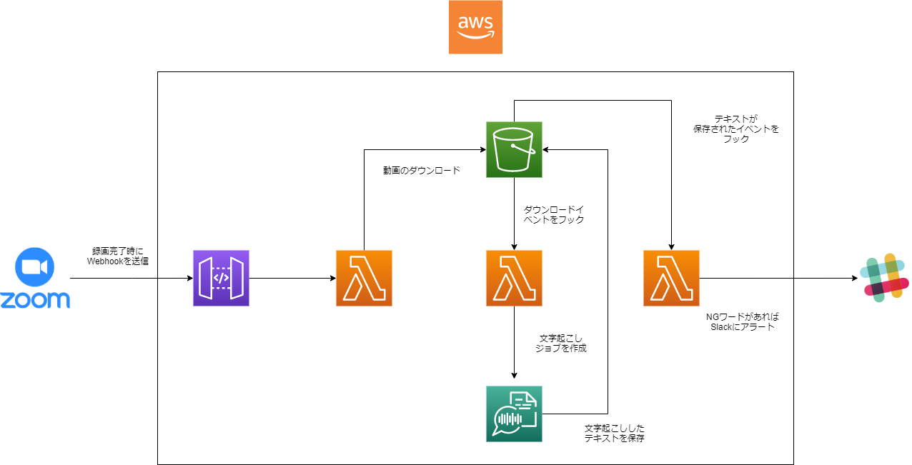

## これは何？

`terraform`を使って簡単にZoomでの録画自動アップロードと自動文字起こし環境を作れるものです。
また文字起こしした内容をLambdaで受け取り、解析できるようにも修正できます。

構成としては以下のような感じです



## 使い方

まず必要な環境変数をターミナルにexportしてください。

```bash
export AWS_ACCESS_KEY_ID=xxxxxxxxxxx
export AWS_SECRET_ACCESS_KEY=xxxxxxxxx
export AWS_REGION=xxxxxxxxx
export TF_VAR_access_key=xxxxxxxxx
export TF_VAR_secret_key=xxxxxxxxx
export TF_VAR_role_arn=xxxxxxxxxx
```

その後、`terraform init`で初期化します。

```bash
terraform init
```

初期化が完了したら`terraform plan`で差分を確認します。

```bash
terraform plan 
```

確認時に文法エラーなど無ければ、`terraform apply`でデプロイできます。


```bash
terraform apply
```